# SSM-Maven
* 基于maven的spring、springMVC、Mybatis项目
* 推荐url接口测试软件：postman.exe
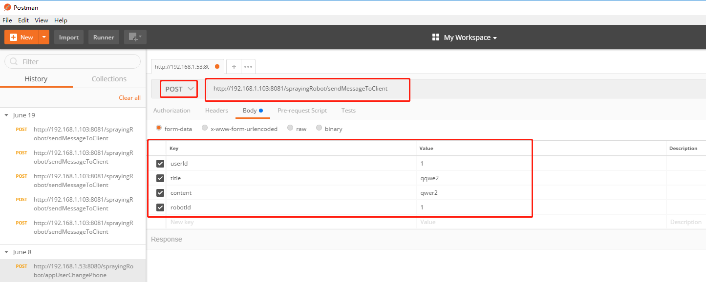
* 推荐插件：方便mapper文件间跳转及sql语句编写

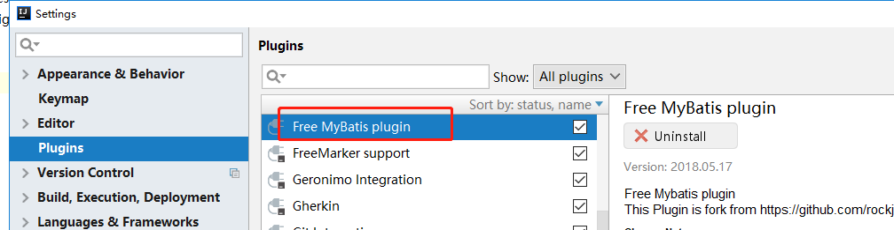

##IntelliJ IDEA中安装、配置以及使用Maven
链接：https://blog.csdn.net/ck4438707/article/details/53377413（或自行百度学习）

##Maven项目导入，按照图片，next到finish，项目导入成功
（项目导入成功后检查下项目中IDEA的Maven仓库路径）

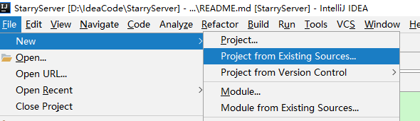

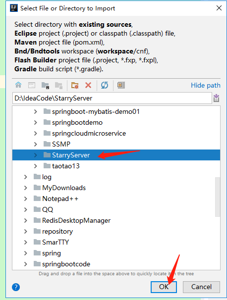

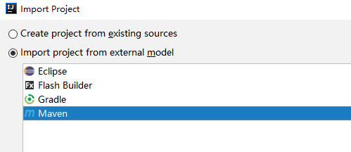

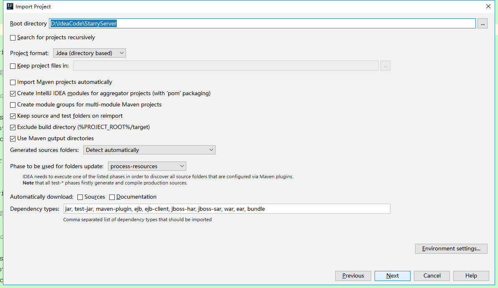

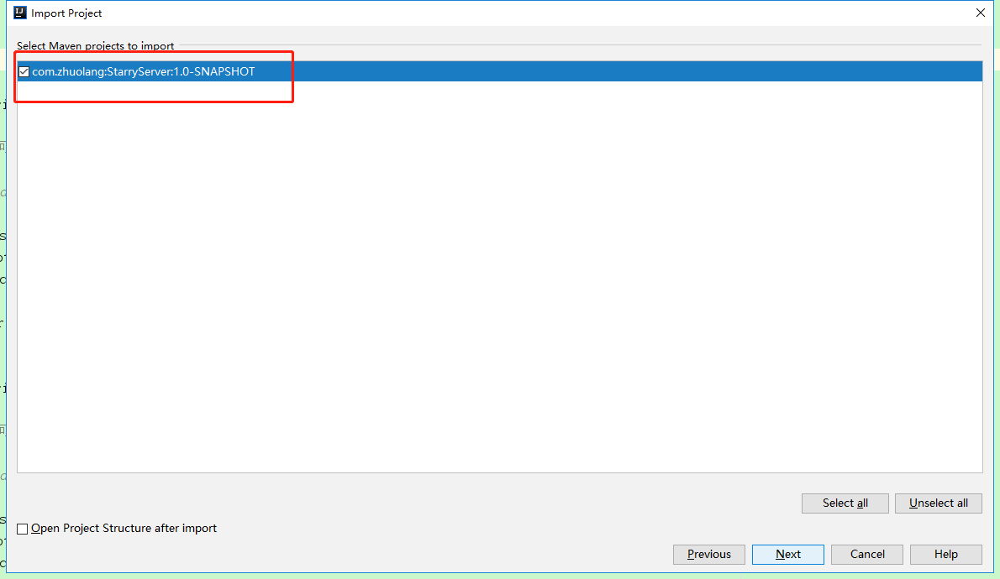

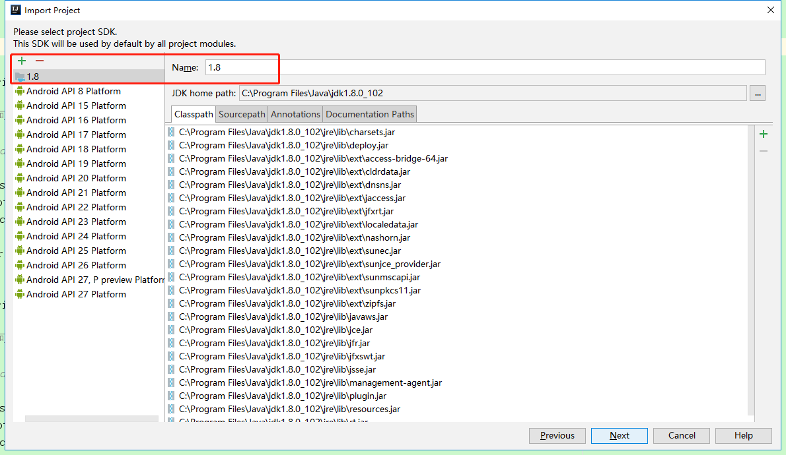

（项目导入成功后检查下项目中IDEA的Maven仓库路径）
###配置Tomcat

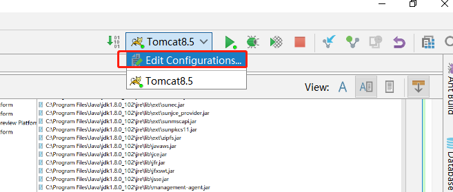

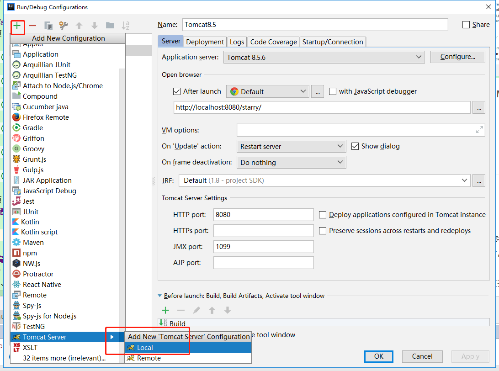

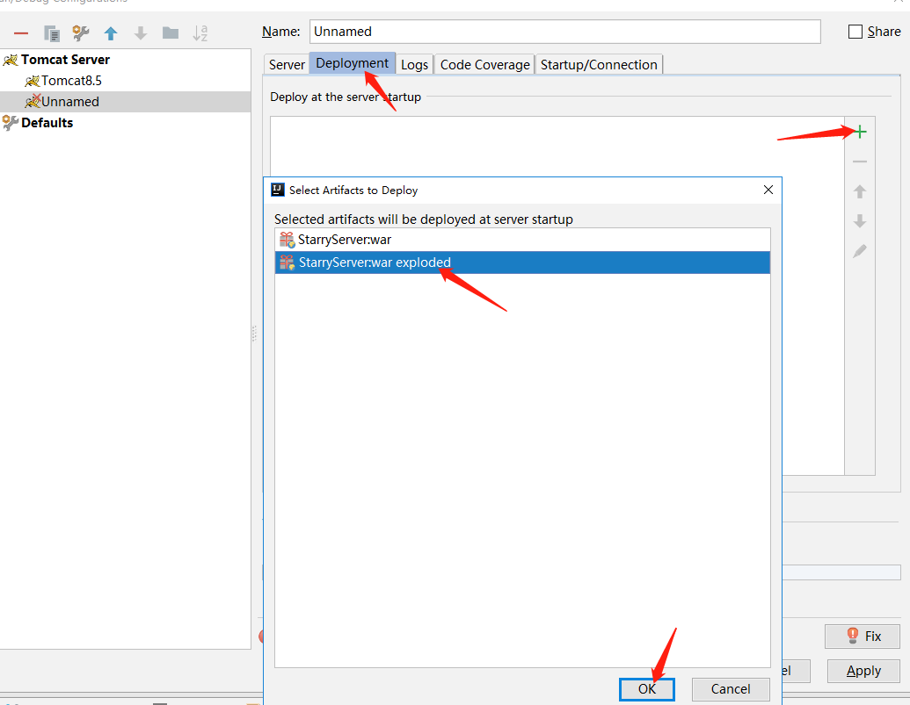

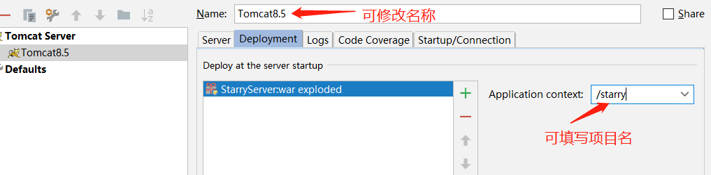

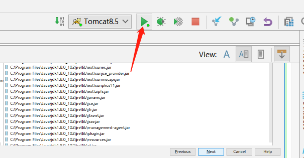

##编码
### 请求时数据走向
* 1、URL请求
* 2、controller处理请求，获取请求参数，调用service接口，传参数到业务层。
controller一般只获取请求参数，返回结果，不进行复杂的数据操作，复杂的数据操作交给业务层
* 3、service调用dao层接口，读写数据库数据，进行复杂的数据处理，返回结果给controller层
* 4、dao层读写数据库数据，返回读写结果

###例：
请求链接：http://localhost:8080/user/findUserByPhone?phone=1
访问后数据请求走向如下图，数据处理后controller返回处理结果（处理成json数据）
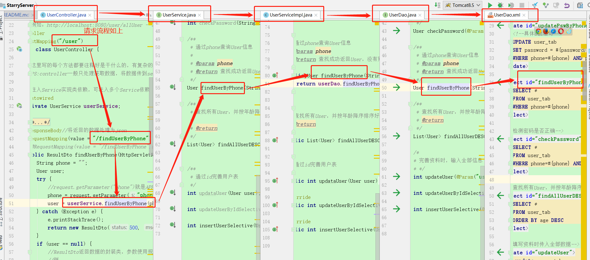

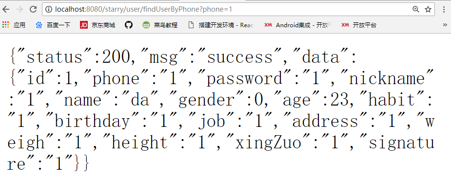

###文件
* main：后台项目文件
* test：测试main里面dao和service里面的方法，放置测试类
* entity:实体类
* dao：数据访问对象的类即dao层类
* service：业务层类
* controller：控制层类
* dto:传输类，例如约影功能需要的实体类，里面定义的变量有对应user_tab表的用户的姓名，性别等和约影表中的电影名，地名，约影详情等。
* utils：工具包，如时间格式的转换工具类TimeUtil
* resources：一些配置的资源文件
* mapper：对应dao包中的类，实现访问数据库操作的SQL语句
* spring：mybatis，spring，springMVC的整合配置文件
* jdbc.properties:连接数据库文件
* mybatis-config.xml:mybatis配置文件
* Pom.xml;POM包括了所有的项目信息，jar包的依赖等
    groupId:项目或者组织的唯一标志，并且配置时生成路径也是由此生成，如		org.myproject.mojo生成的相对路径为：/org/myproject/mojo
    artifactId:项目的通用名称
    version:项目的版本

### springMVC及Mybatis原理图

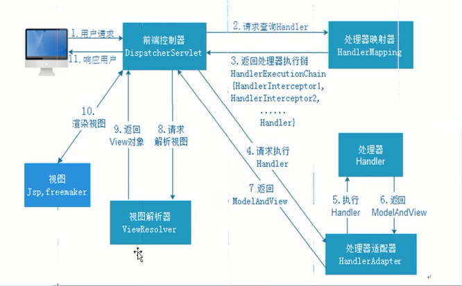
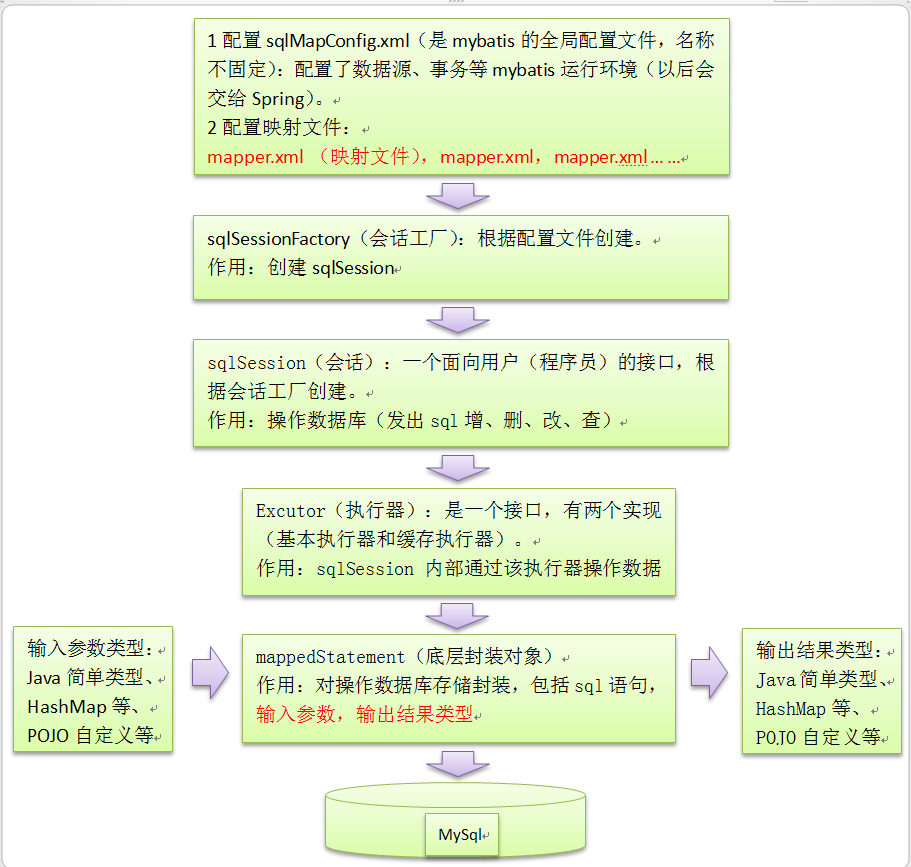

