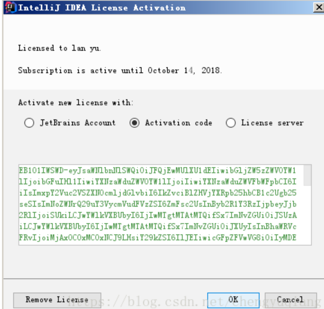
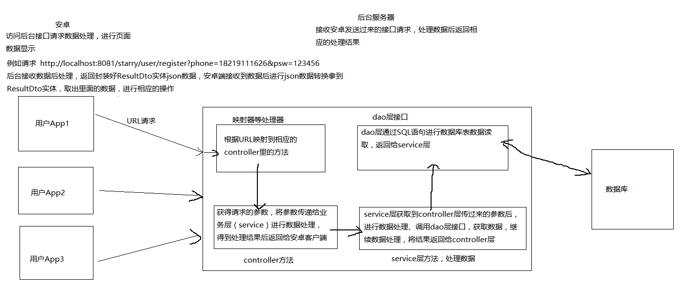

# SSM-Maven
## hibernate事务例子
```java
Transaction ts = null;
try {
    ts = session.beginTransaction();
    // 修改用户
    User user = new User();
    String password = "password";
    String userPhone = "userPhone";
    user.setUserName(userPhone);
    user.setUserPhone(userPhone);
    user.setUserAccount(userPhone);
    user.setPassword(password);
    session.save(user);
    session.save(trapGroup);
    ts.commit();
} catch (Exception e) {
    if(ts!=null) {
        ts.rollback();
    }
    e.printStackTrace();
    throw new RuntimeException(e.getMessage());
} finally {
    if(session!=null && session.isOpen()) {
        session.close();
    }
}
```


### Excel文档导入导出
### idea激活
去 http://idea.lanyus.com/ 获取验证码，复制



关闭软件，修改host文件 C:\Windows\System32\drivers\etc
在host中加入 0.0.0.0 account.jetbrains.com
激活成功

* 基于maven的spring、springMVC、Mybatis项目
* 推荐url接口测试软件：postman.exe

* 推荐插件：方便mapper文件间跳转及sql语句编写


##IntelliJ IDEA中安装、配置以及使用Maven
链接：https://blog.csdn.net/ck4438707/article/details/53377413  （或自行百度学习）

## Maven项目导入，按照图片，next到finish，项目导入成功
（项目导入成功后检查下项目中IDEA的Maven仓库路径）


（项目导入成功后检查下项目中IDEA的Maven仓库路径）
### 配置Tomcat


## 编码
### 请求时数据走向
* 1、URL请求
* 2、controller处理请求，获取请求参数，调用service接口，传参数到业务层。
controller一般只获取请求参数，返回结果，不进行复杂的数据操作，复杂的数据操作交给业务层
* 3、service调用dao层接口，读写数据库数据，进行复杂的数据处理，返回结果给controller层
* 4、dao层读写数据库数据，返回读写结果



### 例：
请求链接：http://localhost:8080/user/findUserByPhone?phone=1
访问后数据请求走向如下图，数据处理后controller返回处理结果（处理成json数据）


### 文件
* main：后台项目文件
* test：测试main里面dao和service里面的方法，放置测试类
* entity:实体类
* dao：数据访问对象的类即dao层类
* service：业务层类
* controller：控制层类
* dto:传输类，例如约影功能需要的实体类，里面定义的变量有对应user_tab表的用户的姓名，性别等和约影表中的电影名，地名，约影详情等。
* utils：工具包，如时间格式的转换工具类TimeUtil
* resources：一些配置的资源文件
* mapper：对应dao包中的类，实现访问数据库操作的SQL语句
* spring：mybatis，spring，springMVC的整合配置文件
* jdbc.properties:连接数据库文件
* mybatis-config.xml:mybatis配置文件
* Pom.xml;POM包括了所有的项目信息，jar包的依赖等
    groupId:项目或者组织的唯一标志，并且配置时生成路径也是由此生成，如org.myproject.mojo生成的相对路径为：/org/myproject/mojo
    artifactId:项目的通用名称
    version:项目的版本

### springMVC及Mybatis原理图


## 学习要点
#### 1、Java基础

Java基本语法、面向对象相关的基本概念与思想，常用String类的api，
异常处理，IO基础，容器，多线程，内存管理与垃圾回收， 
知道几种常见的 Java 设计模式等，建议可以找些网上Java面试宝典之类的文章，
熟悉下面试常遇到的一些Java知识点，一般都是Java基础。

#### 2、框架基础

spring、springMVC、mybatis、hibernate（springboot）
能使用以下技术搭建项目
* springMVC + spring + mybatis
* springMVC + spring + hibernate
* springboot + mybatis

### 了解以上框架原理
其次还需要掌握HTML、CSS、JQurey、ajax、bootstrap、MySQL、
http、socket、json、restful

#### 3、Android基础
* Android基础UI控件。Button、TextView、EditText、CheckBox、RadioButton、
ImageView、Spinner、ProgressBar、SeekBar、RecycleView、ScrollView、
LinearLayout、RelativeLayout等
* Android四大组件的理解与熟练掌握。
Activity的四种启动模式，Fragment的生命周期、Fragment与Activity之间的关系，BroadcastReceiver、ContentProvider、Service的使用场景与具体用法，更细节点的如 BroadcastReceiver 的广播类型与不同的注册方式的区别等都应该关注并理解到位。
* 数据存储。Sqlite与SQL语句得掌握吧，数据库虽然说在客户端开发上只有特定的业务或者场景才用得到，
但是SQL语句这是基础，基本的操作sqlite相关的api也必须要掌握。
* 了解常见的数据格式与解析方法，虽然目前常用的数据格式就是json，解析库也有很多，如Gson等。


